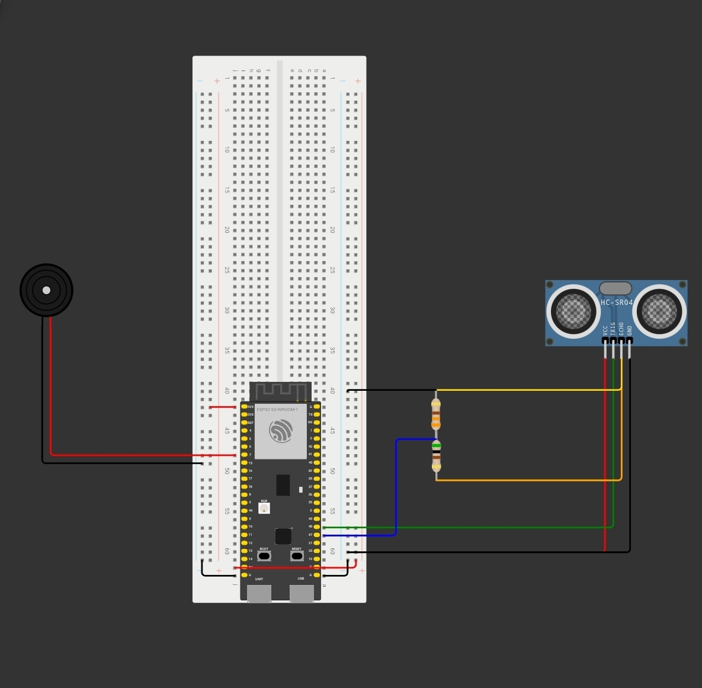

# Door Alarm System

A simple alarm system which will trigger an alarm and post updates to a web server.

Tried to keep the budget low and created with parts I already had. Used two ESP32
microcontrollers. One with the sensors and setup on the door for the alarm, the 
other is to host the web-server for the user see if the alarm has been triggered 
when they away from the alarm itself.

## Components used:
- 2x ESP32 Development Board
- 1x HC-SR04 (Ultrasonic Sensor)
- 1x Passive Buzzer
- 3x Resistors
    - 1x 330Ω Resistor
    - 2x 1000Ω Resistor
- Breadboard jumper wires
- Breadboard

## Features
- ESP32 Bluetooth Communication
- HC-SR04 Ultrasonic distance detection
- Web-based monitoring dashboard
- JSON-based system for status updates
- Real-time status updates

## Wire Diagram

## Wire Diagram Explaination

# PLEASE NOTE, THE PINS ON THE DIAGRAM ARE DIFFERNT THAN THE SCRIPS. CHANGE THE PIN DEFINTIONS IN THE SCRIPTS ACCORDINGLY

The HC-SR04 (Ultrasonic Sensor) requires 5v to function, fortunately the ESP32 board 
has a 5v output. Issue is the ESP32 works on 3.3v logic, meaning when trying to send 
5v back to the ESP32 (via the echo pin) the board can't understand it. I worked around 
this issue by creating a potential divder circuit, so the voltage is dropped from 5v 
to 3.3v.

The rest of the diagram is pretty self explaintory, should be able to replicate with
yourself by following the diagram.
